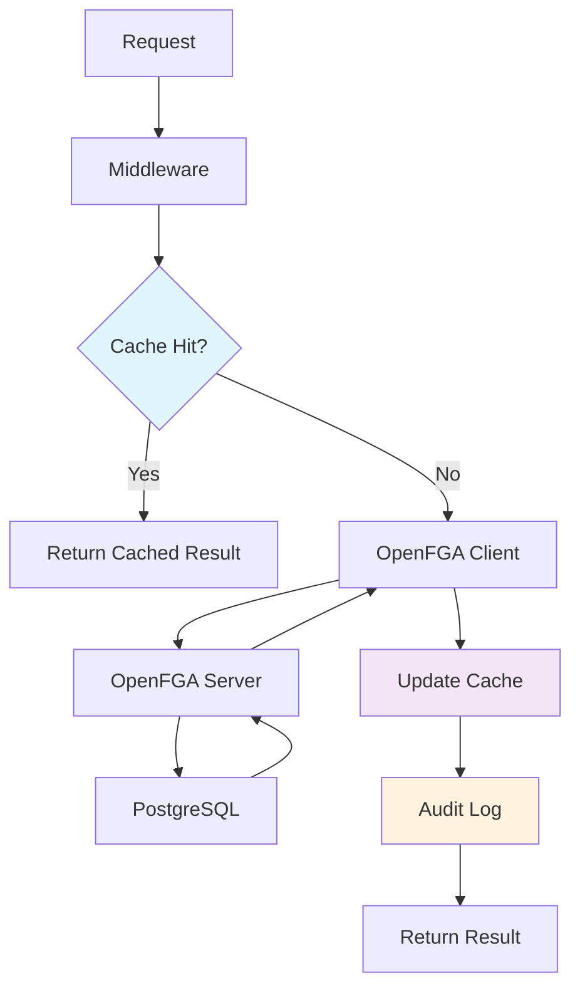

# 🛠️ Plano de Implementação Técnica - Package OpenFGA

## 📋 Resumo Executivo

Este documento detalha a implementação técnica do package de autorização OpenFGA para o Lockari, explicando **o que** será desenvolvido, **por que** cada componente é necessário, e **como** eles se integram ao sistema existente.

## 🎯 Motivação e Justificativa

### Por que desenvolver um package customizado?

1. **Integração Seamless**: O OpenFGA SDK é genérico. Precisamos de uma camada específica do domínio Lockari
2. **Performance**: Cache inteligente e batch operations para otimizar latência
3. **Observabilidade**: Logging estruturado e métricas integradas com o sistema existente
4. **Manutenibilidade**: Interfaces claras que facilitam testes e evolução
5. **Segurança**: Validações específicas e auditoria completa

### Problemas que o package resolve:

❌ **Sem o package:**
```go
// Código repetitivo em cada handler
func GetVault(c *gin.Context) {
    userID := c.GetString("user_id")
    vaultID := c.Param("id")
    
    // Código OpenFGA repetido
    fgaClient := client.NewSdkClient(config)
    body := client.ClientCheckRequest{
        User:     fmt.Sprintf("user:%s", userID),
        Relation: "can_read",
        Object:   fmt.Sprintf("vault:%s", vaultID),
    }
    
    allowed, err := fgaClient.Check(ctx).Body(body).Execute()
    if err != nil {
        // Error handling inconsistente
        c.JSON(500, gin.H{"error": err.Error()})
        return
    }
    
    if !allowed.Allowed {
        c.JSON(403, gin.H{"error": "forbidden"})
        return
    }
    
    // Lógica do handler...
}
```

✅ **Com o package:**
```go
// Código limpo e reutilizável
func GetVault(c *gin.Context) {
    // Middleware já fez a autorização
    // Apenas lógica de negócio aqui
    vaultID := c.Param("id")
    vault, err := vaultService.GetVault(c.Request.Context(), vaultID)
    // ...
}

// No main.go ou router setup:
vaultRoutes.GET("/:id", 
    authzMiddleware.RequireVaultPermission(authorization.VaultPermissionRead),
    handlers.GetVault,
)
```

## 🏗️ Arquitetura Detalhada

### 1. **Camadas da Arquitetura**

```
┌─────────────────────────────────────────────────────────────────┐
│                      Handlers (Gin)                            │ <- Aplicação
├─────────────────────────────────────────────────────────────────┤
│  AuthorizationMiddleware                                        │ <- Middleware
├─────────────────────────────────────────────────────────────────┤
│  LockariAuthorizationService                                    │ <- Domínio
├─────────────────────────────────────────────────────────────────┤
│  AuthorizationService + Cache + Audit                          │ <- Serviços
├─────────────────────────────────────────────────────────────────┤
│  OpenFGA Client                                                 │ <- Infraestrutura
├─────────────────────────────────────────────────────────────────┤
│  OpenFGA SDK                                                    │ <- Biblioteca
└─────────────────────────────────────────────────────────────────┘
```

### 2. **Fluxo de Autorização**



## 🔧 Implementação Detalhada

### 1. **interfaces.go - Contratos Públicos**

#### Justificativa:
- **Testabilidade**: Permite mock fácil em testes
- **Flexibilidade**: Pode trocar implementações sem quebrar código
- **Documentação**: Interfaces servem como documentação do comportamento esperado

#### Implementação:

```go
// AuthorizationService - Interface básica para operações OpenFGA
type AuthorizationService interface {
    // Check verifica uma permissão única
    Check(ctx context.Context, req *CheckRequest) (*CheckResponse, error)
    
    // CheckBatch verifica múltiplas permissões em uma chamada
    CheckBatch(ctx context.Context, reqs []*CheckRequest) ([]*CheckResponse, error)
    
    // ListObjects lista todos os objetos que o usuário pode acessar
    ListObjects(ctx context.Context, req *ListObjectsRequest) (*ListObjectsResponse, error)
    
    // Write cria relacionamentos (tuplas)
    Write(ctx context.Context, req *WriteRequest) error
    
    // Delete remove relacionamentos
    Delete(ctx context.Context, req *DeleteRequest) error
    
    // Health verifica se o OpenFGA está disponível
    Health(ctx context.Context) error
}

// LockariAuthorizationService - Interface específica do domínio
type LockariAuthorizationService interface {
    AuthorizationService
    
    // === VAULT OPERATIONS ===
    CanAccessVault(ctx context.Context, userID, vaultID string, permission VaultPermission) (bool, error)
    SetupVault(ctx context.Context, vaultID, tenantID, ownerID string) error
    ShareVault(ctx context.Context, vaultID, ownerID, targetUserID string, permission VaultPermission) error
    ListAccessibleVaults(ctx context.Context, userID string) ([]string, error)
    
    // === TENANT OPERATIONS ===
    SetupTenant(ctx context.Context, tenantID, ownerID string, features []PlanFeature) error
    AddUserToTenant(ctx context.Context, userID, tenantID string, role TenantRole) error
    RemoveUserFromTenant(ctx context.Context, userID, tenantID string) error
    
    // === GROUP OPERATIONS ===
    CreateGroup(ctx context.Context, groupID, tenantID, ownerID string) error
    AddUserToGroup(ctx context.Context, userID, groupID string, role GroupRole) error
    
    // === TOKEN OPERATIONS ===
    CreateAPIToken(ctx context.Context, userID, vaultID string, permissions []TokenPermission) (string, error)
    CheckTokenPermission(ctx context.Context, tokenID string, permission TokenPermission) (bool, error)
    RevokeToken(ctx context.Context, tokenID string) error
    
    // === EXTERNAL SHARING (Enterprise) ===
    InitiateExternalSharing(ctx context.Context, userID, vaultID, targetTenantID string) (string, error)
    ApproveExternalSharing(ctx context.Context, userID, requestID string) error
    RejectExternalSharing(ctx context.Context, userID, requestID string) error
}
```

### 2. **types.go - Type Safety e Enums**

#### Justificativa:
- **Type Safety**: Evita erros de string incorretas
- **Intellisense**: Melhora experiência do desenvolvedor
- **Validação**: Garante que apenas valores válidos sejam aceitos
- **Evolução**: Facilita adicionar novos tipos sem quebrar código existente

#### Implementação:

```go
// VaultPermission representa as permissões granulares de vault
type VaultPermission string

const (
    VaultPermissionView      VaultPermission = "can_view"      // Ver metadados
    VaultPermissionRead      VaultPermission = "can_read"      // Ler conteúdo
    VaultPermissionCopy      VaultPermission = "can_copy"      // Copiar para clipboard
    VaultPermissionDownload  VaultPermission = "can_download"  // Baixar/exportar
    VaultPermissionWrite     VaultPermission = "can_write"     // Criar/editar
    VaultPermissionDelete    VaultPermission = "can_delete"    // Deletar
    VaultPermissionShare     VaultPermission = "can_share"     // Compartilhar
    VaultPermissionManage    VaultPermission = "can_manage"    // Gerenciar
)

// IsValid verifica se a permissão é válida
func (vp VaultPermission) IsValid() bool {
    switch vp {
    case VaultPermissionView, VaultPermissionRead, VaultPermissionCopy,
         VaultPermissionDownload, VaultPermissionWrite, VaultPermissionDelete,
         VaultPermissionShare, VaultPermissionManage:
        return true
    default:
        return false
    }
}

// String implementa fmt.Stringer
func (vp VaultPermission) String() string {
    return string(vp)
}

// CheckRequest representa uma solicitação de verificação
type CheckRequest struct {
    User     string `json:"user"`     // user:alice
    Relation string `json:"relation"` // can_read
    Object   string `json:"object"`   // vault:123
}

// CheckResponse representa a resposta de uma verificação
type CheckResponse struct {
    Allowed bool   `json:"allowed"`
    Reason  string `json:"reason,omitempty"`
}

// WriteRequest representa uma solicitação para criar tuplas
type WriteRequest struct {
    Tuples []Tuple `json:"tuples"`
}

// Tuple representa uma tupla OpenFGA
type Tuple struct {
    User     string `json:"user"`
    Relation string `json:"relation"`
    Object   string `json:"object"`
}

// ListObjectsRequest representa solicitação para listar objetos
type ListObjectsRequest struct {
    User     string `json:"user"`
    Relation string `json:"relation"`
    Type     string `json:"type"`
}

// ListObjectsResponse representa a resposta da listagem
type ListObjectsResponse struct {
    Objects []string `json:"objects"`
}

// DeleteRequest representa solicitação para deletar tuplas
type DeleteRequest struct {
    Tuples []Tuple `json:"tuples"`
}
```

### 3. **config.go - Configuração Centralizada**

#### Justificativa:
- **Flexibilidade**: Configuração por ambiente (dev, staging, prod)
- **Segurança**: Centraliza credenciais e configurações sensíveis
- **Defaults**: Valores padrão sensatos para desenvolvimento
- **Validação**: Garante que configuração está correta

#### Implementação:

```go
// Config contém todas as configurações do OpenFGA
type Config struct {
    // === OPENFGA SERVER ===
    APIURL               string `mapstructure:"api_url"`
    StoreID              string `mapstructure:"store_id"`
    AuthorizationModelID string `mapstructure:"authorization_model_id"`
    
    // === AUTHENTICATION ===
    APITokenIssuer   string `mapstructure:"api_token_issuer"`
    APIAudience      string `mapstructure:"api_audience"`
    ClientID         string `mapstructure:"client_id"`
    ClientSecret     string `mapstructure:"client_secret"`
    Scopes           string `mapstructure:"scopes"`
    
    // === TIMEOUTS & RETRY ===
    Timeout         time.Duration `mapstructure:"timeout"`
    RetryAttempts   int           `mapstructure:"retry_attempts"`
    RetryDelay      time.Duration `mapstructure:"retry_delay"`
    MaxRetryDelay   time.Duration `mapstructure:"max_retry_delay"`
    
    // === CACHE ===
    CacheEnabled    bool          `mapstructure:"cache_enabled"`
    CacheTTL        time.Duration `mapstructure:"cache_ttl"`
    CacheMaxSize    int           `mapstructure:"cache_max_size"`
    CacheCleanupInterval time.Duration `mapstructure:"cache_cleanup_interval"`
    
    // === AUDIT ===
    AuditEnabled    bool   `mapstructure:"audit_enabled"`
    AuditLevel      string `mapstructure:"audit_level"`
    
    // === PERFORMANCE ===
    MaxConcurrentRequests int           `mapstructure:"max_concurrent_requests"`
    BatchSize            int           `mapstructure:"batch_size"`
    ConnectionPoolSize   int           `mapstructure:"connection_pool_size"`
    
    // === HEALTH CHECK ===
    HealthCheckEnabled  bool          `mapstructure:"health_check_enabled"`
    HealthCheckInterval time.Duration `mapstructure:"health_check_interval"`
}

// NewConfig cria uma nova configuração com valores padrão
func NewConfig() *Config {
    return &Config{
        APIURL:               "http://localhost:8080",
        Timeout:              30 * time.Second,
        RetryAttempts:        3,
        RetryDelay:           1 * time.Second,
        MaxRetryDelay:        10 * time.Second,
        CacheEnabled:         true,
        CacheTTL:             5 * time.Minute,
        CacheMaxSize:         10000,
        CacheCleanupInterval: 10 * time.Minute,
        AuditEnabled:         true,
        AuditLevel:           "info",
        MaxConcurrentRequests: 100,
        BatchSize:            50,
        ConnectionPoolSize:   10,
        HealthCheckEnabled:   true,
        HealthCheckInterval:  30 * time.Second,
    }
}

// Validate valida se a configuração está correta
func (c *Config) Validate() error {
    if c.APIURL == "" {
        return errors.New("api_url is required")
    }
    
    if c.StoreID == "" {
        return errors.New("store_id is required")
    }
    
    if c.AuthorizationModelID == "" {
        return errors.New("authorization_model_id is required")
    }
    
    if c.Timeout <= 0 {
        return errors.New("timeout must be positive")
    }
    
    if c.RetryAttempts < 0 {
        return errors.New("retry_attempts cannot be negative")
    }
    
    if c.CacheMaxSize <= 0 {
        return errors.New("cache_max_size must be positive")
    }
    
    return nil
}

// LoadFromViper carrega configuração do Viper
func LoadFromViper(v *viper.Viper) (*Config, error) {
    config := NewConfig()
    
    if err := v.UnmarshalKey("openfga", config); err != nil {
        return nil, fmt.Errorf("failed to unmarshal config: %w", err)
    }
    
    if err := config.Validate(); err != nil {
        return nil, fmt.Errorf("config validation failed: %w", err)
    }
    
    return config, nil
}
```

### 4. **client.go - Cliente OpenFGA Otimizado**

#### Justificativa:
- **Retry Logic**: Lida com falhas de rede e timeouts
- **Connection Pooling**: Otimiza performance
- **Logging**: Facilita debug e monitoramento
- **Metrics**: Expõe métricas para observabilidade

#### Implementação:

```go
// Client é um wrapper otimizado para o OpenFGA SDK
type Client struct {
    fgaClient *client.OpenFgaClient
    config    *Config
    logger    *slog.Logger
    metrics   *ClientMetrics
    
    // Circuit breaker para falhas
    circuitBreaker *CircuitBreaker
    
    // Limiter para controle de taxa
    rateLimiter *rate.Limiter
    
    // Context para shutdown graceful
    ctx    context.Context
    cancel context.CancelFunc
}

// ClientMetrics contém métricas do cliente
type ClientMetrics struct {
    RequestsTotal     *prometheus.CounterVec
    RequestDuration   *prometheus.HistogramVec
    ErrorsTotal       *prometheus.CounterVec
    CacheHitRate      *prometheus.GaugeVec
    CircuitBreakerState *prometheus.GaugeVec
}

// NewClient cria um novo cliente OpenFGA
func NewClient(config *Config, logger *slog.Logger) (*Client, error) {
    if err := config.Validate(); err != nil {
        return nil, fmt.Errorf("invalid config: %w", err)
    }
    
    // Configurar credenciais
    var credentials *credentials.Credentials
    if config.ClientID != "" && config.ClientSecret != "" {
        credentials = &credentials.Credentials{
            Method: credentials.CredentialsMethodClientCredentials,
            Config: &credentials.Config{
                ClientCredentialsConfig: &credentials.ClientCredentialsConfig{
                    TokenIssuer:   config.APITokenIssuer,
                    TokenAudience: config.APIAudience,
                    ClientId:      config.ClientID,
                    ClientSecret:  config.ClientSecret,
                    Scopes:        strings.Split(config.Scopes, " "),
                },
            },
        }
    } else {
        credentials = &credentials.Credentials{
            Method: credentials.CredentialsMethodNone,
        }
    }
    
    // Configurar cliente OpenFGA
    configuration := &client.Configuration{
        ApiUrl:               config.APIURL,
        StoreId:              config.StoreID,
        AuthorizationModelId: config.AuthorizationModelID,
        Credentials:          credentials,
        UserAgent:           "lockari-backend/1.0",
        DefaultTimeout:       config.Timeout,
        MaxRetry:            config.RetryAttempts,
        MinWaitTime:         config.RetryDelay,
        MaxWaitTime:         config.MaxRetryDelay,
    }
    
    fgaClient := client.NewSdkClient(configuration)
    
    // Configurar rate limiter
    rateLimiter := rate.NewLimiter(rate.Limit(config.MaxConcurrentRequests), config.MaxConcurrentRequests)
    
    // Configurar circuit breaker
    circuitBreaker := NewCircuitBreaker(config.RetryAttempts, config.Timeout)
    
    // Context para shutdown
    ctx, cancel := context.WithCancel(context.Background())
    
    // Métricas
    metrics := &ClientMetrics{
        RequestsTotal: prometheus.NewCounterVec(
            prometheus.CounterOpts{
                Name: "openfga_requests_total",
                Help: "Total number of OpenFGA requests",
            },
            []string{"method", "status"},
        ),
        RequestDuration: prometheus.NewHistogramVec(
            prometheus.HistogramOpts{
                Name: "openfga_request_duration_seconds",
                Help: "Duration of OpenFGA requests",
            },
            []string{"method"},
        ),
        ErrorsTotal: prometheus.NewCounterVec(
            prometheus.CounterOpts{
                Name: "openfga_errors_total",
                Help: "Total number of OpenFGA errors",
            },
            []string{"method", "error_type"},
        ),
    }
    
    client := &Client{
        fgaClient:      fgaClient,
        config:         config,
        logger:         logger,
        metrics:        metrics,
        circuitBreaker: circuitBreaker,
        rateLimiter:    rateLimiter,
        ctx:            ctx,
        cancel:         cancel,
    }
    
    // Health check inicial
    if config.HealthCheckEnabled {
        if err := client.healthCheck(); err != nil {
            return nil, fmt.Errorf("initial health check failed: %w", err)
        }
    }
    
    return client, nil
}

// Check verifica uma permissão com retry e circuit breaker
func (c *Client) Check(ctx context.Context, user, relation, object string) (bool, error) {
    // Rate limiting
    if err := c.rateLimiter.Wait(ctx); err != nil {
        return false, fmt.Errorf("rate limit exceeded: %w", err)
    }
    
    // Logging
    logger := c.logger.With(
        "method", "check",
        "user", user,
        "relation", relation,
        "object", object,
    )
    
    logger.Debug("Starting permission check")
    
    // Métricas
    timer := prometheus.NewTimer(c.metrics.RequestDuration.WithLabelValues("check"))
    defer timer.ObserveDuration()
    
    // Circuit breaker
    result, err := c.circuitBreaker.Execute(func() (interface{}, error) {
        return c.checkInternal(ctx, user, relation, object)
    })
    
    if err != nil {
        c.metrics.ErrorsTotal.WithLabelValues("check", "circuit_breaker").Inc()
        logger.Error("Permission check failed", "error", err)
        return false, err
    }
    
    allowed := result.(bool)
    
    c.metrics.RequestsTotal.WithLabelValues("check", "success").Inc()
    logger.Info("Permission check completed", "allowed", allowed)
    
    return allowed, nil
}

// checkInternal executa a verificação sem retry/circuit breaker
func (c *Client) checkInternal(ctx context.Context, user, relation, object string) (bool, error) {
    body := client.ClientCheckRequest{
        User:     user,
        Relation: relation,
        Object:   object,
    }
    
    data, err := c.fgaClient.Check(ctx).Body(body).Execute()
    if err != nil {
        return false, fmt.Errorf("openfga check failed: %w", err)
    }
    
    return data.Allowed, nil
}

// healthCheck verifica se o OpenFGA está saudável
func (c *Client) healthCheck() error {
    ctx, cancel := context.WithTimeout(context.Background(), 5*time.Second)
    defer cancel()
    
    // Tentar uma operação simples
    _, err := c.fgaClient.ReadAuthorizationModel(ctx).Execute()
    if err != nil {
        return fmt.Errorf("health check failed: %w", err)
    }
    
    return nil
}

// Close fecha o cliente gracefully
func (c *Client) Close() error {
    c.cancel()
    return nil
}
```

### 5. **service.go - Serviço Principal**

#### Justificativa:
- **Orchestração**: Combina cliente, cache e auditoria
- **Business Logic**: Implementa regras específicas do Lockari
- **Validation**: Valida inputs e formatos
- **Error Handling**: Tratamento consistente de erros

#### Implementação:

```go
// Service implementa AuthorizationService
type Service struct {
    client *Client
    cache  Cache
    audit  AuditService
    config *Config
    logger *slog.Logger
}

// NewService cria um novo serviço de autorização
func NewService(client *Client, cache Cache, audit AuditService, config *Config, logger *slog.Logger) *Service {
    return &Service{
        client: client,
        cache:  cache,
        audit:  audit,
        config: config,
        logger: logger,
    }
}

// Check implementa AuthorizationService.Check
func (s *Service) Check(ctx context.Context, req *CheckRequest) (*CheckResponse, error) {
    // Validação
    if err := s.validateCheckRequest(req); err != nil {
        return nil, fmt.Errorf("invalid request: %w", err)
    }
    
    // Cache key
    cacheKey := fmt.Sprintf("%s:%s:%s", req.User, req.Relation, req.Object)
    
    // Verificar cache
    if s.config.CacheEnabled {
        if cached, found := s.cache.Get(cacheKey); found {
            s.logger.Debug("Cache hit", "key", cacheKey)
            return &CheckResponse{Allowed: cached}, nil
        }
    }
    
    // Verificar no OpenFGA
    allowed, err := s.client.Check(ctx, req.User, req.Relation, req.Object)
    if err != nil {
        s.audit.LogPermissionCheck(ctx, PermissionCheckEvent{
            User:     req.User,
            Relation: req.Relation,
            Object:   req.Object,
            Result:   "error",
            Error:    err.Error(),
        })
        return nil, err
    }
    
    // Cache do resultado
    if s.config.CacheEnabled {
        s.cache.Set(cacheKey, allowed, s.config.CacheTTL)
    }
    
    // Auditoria
    s.audit.LogPermissionCheck(ctx, PermissionCheckEvent{
        User:     req.User,
        Relation: req.Relation,
        Object:   req.Object,
        Result:   fmt.Sprintf("allowed:%v", allowed),
    })
    
    return &CheckResponse{Allowed: allowed}, nil
}

// CheckBatch implementa verificação em lote
func (s *Service) CheckBatch(ctx context.Context, reqs []*CheckRequest) ([]*CheckResponse, error) {
    if len(reqs) == 0 {
        return nil, errors.New("empty request list")
    }
    
    if len(reqs) > s.config.BatchSize {
        return nil, fmt.Errorf("batch size %d exceeds limit %d", len(reqs), s.config.BatchSize)
    }
    
    responses := make([]*CheckResponse, len(reqs))
    
    // Processar em paralelo com limite de concorrência
    sem := make(chan struct{}, s.config.MaxConcurrentRequests)
    var wg sync.WaitGroup
    var mu sync.Mutex
    
    for i, req := range reqs {
        wg.Add(1)
        go func(index int, request *CheckRequest) {
            defer wg.Done()
            
            sem <- struct{}{}
            defer func() { <-sem }()
            
            resp, err := s.Check(ctx, request)
            
            mu.Lock()
            if err != nil {
                responses[index] = &CheckResponse{
                    Allowed: false,
                    Reason:  err.Error(),
                }
            } else {
                responses[index] = resp
            }
            mu.Unlock()
        }(i, req)
    }
    
    wg.Wait()
    
    return responses, nil
}

// validateCheckRequest valida uma solicitação de verificação
func (s *Service) validateCheckRequest(req *CheckRequest) error {
    if req == nil {
        return errors.New("request cannot be nil")
    }
    
    if req.User == "" {
        return errors.New("user cannot be empty")
    }
    
    if req.Relation == "" {
        return errors.New("relation cannot be empty")
    }
    
    if req.Object == "" {
        return errors.New("object cannot be empty")
    }
    
    // Validar formato do usuário
    if !strings.HasPrefix(req.User, "user:") {
        return errors.New("user must start with 'user:'")
    }
    
    // Validar formato do objeto
    parts := strings.Split(req.Object, ":")
    if len(parts) != 2 {
        return errors.New("object must be in format 'type:id'")
    }
    
    return nil
}
```

Esta implementação técnica detalhada mostra **por que** cada componente é necessário e **como** eles trabalham juntos para criar um sistema robusto de autorização. O próximo passo seria implementar cada arquivo seguindo essas especificações.

## 📋 Benefícios da Implementação

1. **Performance**: Cache + batch operations + connection pooling
2. **Confiabilidade**: Retry logic + circuit breaker + health checks
3. **Observabilidade**: Logging estruturado + métricas + auditoria
4. **Manutenibilidade**: Interfaces claras + testes + documentação
5. **Segurança**: Validações + auditoria + isolamento

A implementação seguirá este plano técnico detalhado, garantindo que cada componente tenha uma justificativa clara e se integre perfeitamente com o sistema existente.
